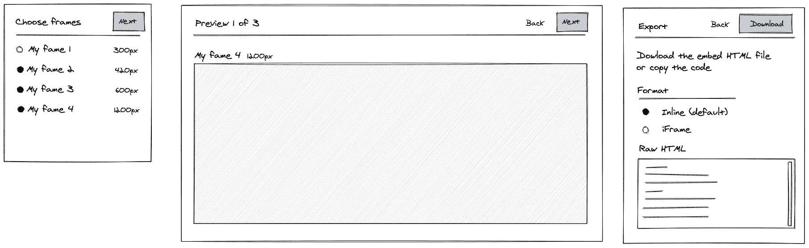

# Figma to HTML embed plug-in

Figma plug-in that helps generate HTML embeds.

## Feaures

- Takes frames from current page and generates embedded SVGs
- Shows preview of output at different breakpoints
- Show help when starting for first time or when no frames are present
- Warning about missing breakpoints
- Warn about unsupported content
- Choice of output format in-line or iframe
- Saves output as a HTML file for easy ouput (or ZIP)?
- Choose frames when more than three are present
- Choose frames when names don't match (mobile/tablet/desktop)

## Tasks

- [Figma] Create collection of target frames
- [Figma] Show help if no frames present
- [Figma] Show list of frames if more than three present
- [Figma] Show list if frame names don't match
- [Figma] ...
- [Improvement] Optimise images

## UI

https://excalidraw.com/#json=5639235562373120,iIxcqDef2XZB51CTcfitwA

## Notes

What is wanted from this tool

- Long form write-up for Nicola
- How we put graphics (charts) into long-form
- Fraiser uses AI2HTML script (no need to alter-workflow) - It auto populates head-footer & source - Remove these - Print designers use this

## References

[Responsive sticky text SVGs](https://bl.ocks.org/veltman/5cd1ba0b3c623e7b5146
[Grid widths](https://docs.google.com/spreadsheets/d/1AxeiLKKsQn7pq6wFKcKsSbAgR44K8CA1cLyBYre64IY/edit?ts=5ebd2636#gid=0)

## Examples

Telegraph AI2HTML Covid graphs

- https://cf-particle-html.eip.telegraph.co.uk/b6b65be9-f851-4a02-acf6-a07756bdaed0.html
- https://cf-particle-html.eip.telegraph.co.uk/7146379a-a29b-4d05-8a7f-c5070c8c63dc.html
- https://cf-particle-html.eip.telegraph.co.uk/9bbfbfb6-452f-4626-951a-5d9712df2139.html
- https://cf-particle-html.eip.telegraph.co.uk/e21e19d7-f4db-490a-b901-6f7b62b41a79.html?ref=https://www.telegraph.co.uk/news/2020/05/14/second-deadly-wave-coronavirus-hit-europe-winter/&title=Exclusive:%20Second%20more%20deadly%20wave%20of%20coronavirus%20%27to%20hit%20Europe%20this%20winter%27
