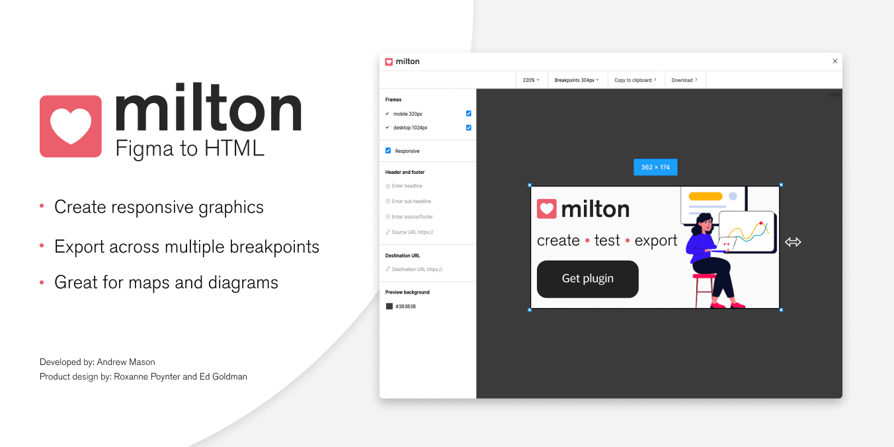

# Milton



Milton is a Figma plugin that makes it easy to convert your graphics into responsive HTML and CSS. Download or copy the code and embed directly on to your web-page

Inspired by the great [ai2html](http://ai2html.org/) for Adobe Illustrator.

## Features

- Export frames from current page into embedded SVGs
- Preview output at different breakpoints
- Generate responsive embeds
- Show help when starting for first time or when no frames are present
- Optimize file size with image resize and compression
- Output directly to a HTML or copy to the clipboard

## Development

For detailed information on Figma plugin development and the API checkout the
[official Figma plugin docs](https://www.figma.com/plugin-docs/intro/).

To get started run the following:

```bash
npm install
npm run dev
```

Load the `manifest.json` file located in the `build` folder into Figma to crate
a new plugin.

Once you've created a new plugin you can use the development console
within Figma to test and debug the plugin. Saving changes will automatically
rebuild allowing you to reload the plugin in Figma.

## Changelog

### 0.1.53

- Preparation for public launch

### 0.1.52

- Improve quality of PNG resizing

### 0.1.51

- Remove image compression for simple PNG conversion to all for alpha transparency

### 0.1.5

- Compress images and simplify SVG shapes

### 0.1.4

- Scaling preview support

### 0.1.3

- Batch select frames and responsive setting
- Background tint
- Copy inline-embed to clipboard
- Select all frames by default
- Hide advanced output settings by default
- Frame ordering
- Nested frames (auto-layout) text position
- Mask not working with mulitple frames

### 0.1.2

- Improvement: Added initial responsive frame support

### 0.1.1

- Improvement: Add file size information and warning

### 0.1.0

- Improvement: New logo
- Improvement: Support window resizing
- Improvement: Auto-size window based on fames
- Fix: Only select top level frames on page

## Credits

Created at **The Telegraph** by the **Product Design Team**

- DEVELOPER - Andrew Mason
- PRODUCT DESIGNER - Ed Goldman
- PRODUCT DESIGNER - Roxanne Poynter
